<!--
  Ibadat Ali — GitHub Profile README
  Repository name must be exactly: Ibadat-Ali86
-->

<p align="center">
  <picture>
    <source media="(prefers-color-scheme: dark)" srcset="./assets/banner-dark.svg">
    <source media="(prefers-color-scheme: light)" srcset="./assets/banner-light.svg">
    
  </picture>
</p>

<p align="center">
  
</p>

<h1 align="center">Ibadat Ali</h1>
<p align="center"><strong>Data Scientist · ML Engineer · DevOps Practitioner</strong></p>
<p align="center">I build explainable AI systems, predictive analytics products, research prototypes, and full-stack tools designed for real-world constraints.</p>

<p align="center">
  <picture>
    <source media="(prefers-color-scheme: dark)" srcset="https://readme-typing-svg.demolab.com?font=IBM+Plex+Mono&amp;weight=600&amp;size=19&amp;pause=1000&amp;color=B8FF29&amp;center=true&amp;vCenter=true&amp;width=900&amp;lines=AI+systems+that+survive+the+real+world.;From+data+to+decision+to+delivery.;Research+engineering+%C3%97+full-stack+execution.">
    <source media="(prefers-color-scheme: light)" srcset="https://readme-typing-svg.demolab.com?font=IBM+Plex+Mono&amp;weight=600&amp;size=19&amp;pause=1000&amp;color=456F00&amp;center=true&amp;vCenter=true&amp;width=900&amp;lines=AI+systems+that+survive+the+real+world.;From+data+to+decision+to+delivery.;Research+engineering+%C3%97+full-stack+execution.">
    
  </picture>
</p>

<p align="center">
  <a href="https://ibadat-ali-portfolio.vercel.app/"></a>
  <a href="https://www.linkedin.com/in/mirzaibadatali"></a>
  <a href="https://www.kaggle.com/ibadatali"></a>
  <a href="mailto:ibadcodes@gmail.com"></a>
</p>

---

## `> whoami`

```javascript
const ibadat = {
  role: ["Data Scientist", "ML Engineer", "DevOps Practitioner"],
  focus: [
    "Explainable AI systems",
    "Predictive analytics",
    "Research engineering",
    "Full-stack AI products",
    "Reliable deployment workflows"
  ],
  principle: "Models matter. The system around them matters more."
};
```

I work across the complete lifecycle of an intelligent product: **data preparation, model development, backend APIs, interfaces, deployment, monitoring, and honest evaluation**.

## `> featured_systems`

| System | What it does | Core stack | Access |
|---|---|---|---|
| **CodeScope MCP Preflight** | Local-first repository intelligence for safer reuse, extension, and implementation decisions. | Python · MCP · Tree-sitter · Chroma | [Source](https://github.com/Ibadat-Ali86/codescope-mcp-preflight) |
| **CareVision** | Multimodal clinical decision-support PWA designed around explainable and secure workflows. | React · TypeScript · FastAPI · PostgreSQL · Gemini | [Live](https://carevision-chw.vercel.app/) · [Source](https://github.com/Ibadat-Ali86/carevision) |
| **SentinelIQ** | NASA turbofan remaining-useful-life forecasting with anomaly detection and maintenance planning. | PyTorch · TCN/LSTM · SHAP · FastAPI · Next.js · Docker | [Live](https://sentinel-iq-nasa.vercel.app) · [Source](https://github.com/Ibadat-Ali86/sentinel-iq-cmpass-nasa-rul-prediction) |
| **TopoLite-KD** | Lightweight topology-aware knowledge distillation for COVID-19 CT-slice research. | PyTorch · GUDHI · Persistent Homology · Grad-CAM | [Source](https://github.com/Ibadat-Ali86/TopoLite-KD-Efficient-Topology-Aware-Knowledge-Distillation-for-COVID-19-CT-Slice-Classification) |
| **AdaptIQ / ForecastAI** | Retail forecasting workflow with scenarios, confidence ranges, monitoring, and reports. | Prophet · XGBoost · SARIMA · LSTM · FastAPI · React | [Live](https://huggingface.co/spaces/ibadatali/walmart-sales-forecasting-saas) · [Source](https://github.com/Ibadat-Ali86/Demand-Sales-Walmart-Forecasting) |
| **Evershine Academy** | Multi-campus academy and learning-management platform for admissions, attendance, academics, finance, reporting, and role-based portals. | Next.js · TypeScript · Prisma · MySQL · RBAC | [Live](https://evershineacadmey.com/) |

<p align="center">
  <a href="https://ibadat-ali-portfolio.vercel.app/#featured"><strong>Explore the full project atlas →</strong></a>
</p>

## `> technical_stack`

<p align="center">
  
</p>

<table>
  <tr>
    <td><strong>Data &amp; ML</strong></td>
    <td>Python, pandas, NumPy, scikit-learn, PyTorch, forecasting, explainability, persistent homology</td>
  </tr>
  <tr>
    <td><strong>Product Engineering</strong></td>
    <td>FastAPI, Flask, React, Next.js, TypeScript, Vite, PostgreSQL, MySQL</td>
  </tr>
  <tr>
    <td><strong>Delivery</strong></td>
    <td>Docker, CI/CD, testing, cloud deployment, monitoring, reproducible workflows</td>
  </tr>
</table>

## `> github_signal`

<p align="center">
  <sub><strong>LIVE CONTRIBUTION TRAIL</strong> · REAL ACTIVITY · REFRESHED DAILY</sub>
</p>

<p align="center">
  <picture>
    <source media="(prefers-color-scheme: dark)" srcset="https://raw.githubusercontent.com/Ibadat-Ali86/Ibadat-Ali86/output/github-contribution-grid-snake-dark.svg">
    <source media="(prefers-color-scheme: light)" srcset="https://raw.githubusercontent.com/Ibadat-Ali86/Ibadat-Ali86/output/github-contribution-grid-snake.svg">
    
  </picture>
</p>

<p align="center">
  <picture>
    <source media="(prefers-color-scheme: dark)" srcset="https://github-profile-summary-cards.vercel.app/api/cards/stats?username=Ibadat-Ali86&amp;theme=github_dark&amp;title_color=B8FF29&amp;text_color=E6EDF3&amp;icon_color=46D9FF">
    <source media="(prefers-color-scheme: light)" srcset="https://github-profile-summary-cards.vercel.app/api/cards/stats?username=Ibadat-Ali86&amp;theme=github&amp;title_color=456F00&amp;text_color=1F2937&amp;icon_color=007B9E">
    
  </picture>
  <picture>
    <source media="(prefers-color-scheme: dark)" srcset="https://github-profile-summary-cards.vercel.app/api/cards/repos-per-language?username=Ibadat-Ali86&amp;theme=github_dark&amp;title_color=B8FF29&amp;text_color=E6EDF3&amp;chart_color=46D9FF">
    <source media="(prefers-color-scheme: light)" srcset="https://github-profile-summary-cards.vercel.app/api/cards/repos-per-language?username=Ibadat-Ali86&amp;theme=github&amp;title_color=456F00&amp;text_color=1F2937&amp;chart_color=007B9E">
    
  </picture>
</p>

## `> operating_principles`

```text
01. Start with the real constraint, not the fashionable model.
02. Make evaluation, uncertainty, and limitations visible.
03. Connect the model to a usable product and dependable workflow.
04. Prefer reproducible evidence over unsupported performance claims.
05. Ship systems people can understand, operate, and trust.
```

---

<p align="center">
  <strong>DATA → DECISION → DELIVERY</strong><br>
  <sub>AI systems · Research engineering · Data products · Full-stack execution</sub>
</p>
